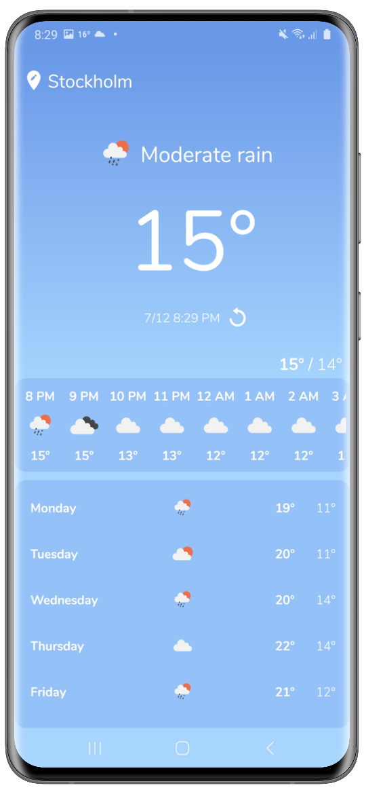

# Weather App Android
[Code Shortcut](app/src/main/java/com/fredrikbogg/weatherapp)

## Description
This is a demo application built with the goal to learn about networking and how to work with location data.

The application provides some of the basic functionality from a standard weather app.

#### Technologies
* Android Studio, Kotlin
* [OpenWeather API](https://openweathermap.org/)
* [Retrofit HTTP Client](https://square.github.io/retrofit/)
* Google Places API
* Reverse geocoding
* Google Play services

#### Features
* Show weather info from the user's current and specified location
* Search and change location
* Weather info: Current, 24 hours, 7 days.
* Localization support for Time and Date
* Saving selected location

## Screenshots
<table>
<thead>
<tr>
<th align="center">Main Activity</th>
</tr>
</thead>
<tbody>
<tr>
<td> </td>
</tr>
</tbody>
</table>

## Setup
#### Requirements
* Basic knowledge about Android Studio

#### Project
1. Download and open the project in Android Studio
2. Connect your Android phone or use the emulator to start the application

#### Weather API
  1. Sign up and retrieve a key from https://openweathermap.org/
  2. Edit the file [OpenWeatherAPI.kt](app/src/main/java/com/fredrikbogg/weatherapp/utils/OpenWeatherAPI.kt)

#### Google Places
 1. Sign up and retrieve a 'Places API' key using their console from  https://cloud.google.com/maps-platform/
 2. Edit the file [GooglePlacesAPI.kt](app/src/main/java/com/fredrikbogg/weatherapp/utils/GooglePlacesAPI.kt)
